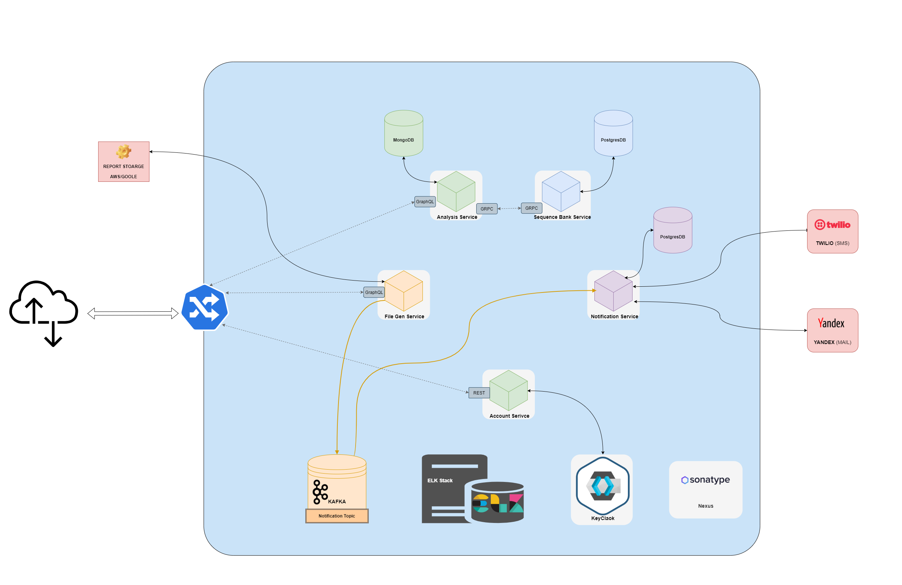

# docs

Documentation for mydna.codes organization.

## Arhitecture diagram



## Bumping project versions

```bash
# To bump maven project version
mvn versions:set "-DnewVersion=<NEW_VERSION>"

# If you made a mistake
mvn versions:revert

# And finally
mvn versions:commit
```

Also bump version in `config.xml` and `README.md` file.

For **production**, make sure you change version in `.travis.yml` file.
